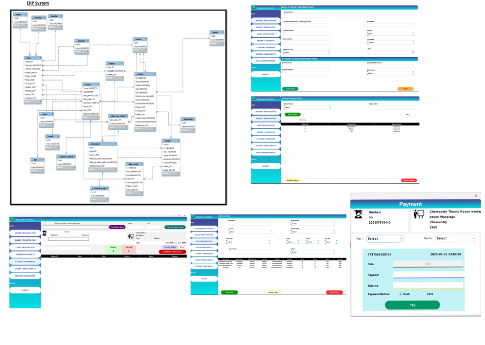

# 🎓 Adyapana Institute Management System (AIMS)

A premium, modern, and high-performance **Java Swing Desktop Application** designed to streamline student registration, class scheduling, attendance tracking, and monthly payment billing for **Adyapana Institute**. 

Featuring a sleek, modern UI powered by the **FlatLaf** look-and-feel engine and integrated with **JasperReports** for custom billing receipt generation, this system provides a robust solution for academic institute administration.

---

## 🖼️ System Overview & Database Schema

Here is a visual overview of the application interfaces (Student Registration, Subject Registration, Class Scheduling, Attendance Logging, and Invoice Payments) along with the complete Entity-Relationship (ER) Diagram:



---

## ✨ Features at a Glance

### 👥 Student & Teacher Management
*   **Detailed Registration**: Register students and teachers with complete bio-data, academic stream, A/L year, gender, and contact details.
*   **Guardian Integration**: Connect student profiles directly to parent/guardian contact info and relationships (Father, Mother, Guardian, etc.).
*   **Searchable Directories**: Dynamically filter, search, and manage students and teachers in modern tabular interfaces.

### 📚 Course & Class Administration
*   **Subject Directory**: Organize subjects mapped directly to specific advanced level streams.
*   **Class Scheduler**: Register classes with detailed attributes: Subject, Stream, AL Year, assigned Teacher, Weekday schedule, custom hourly time-slots, and monthly Class Fees.

### 📝 Attendance Management
*   **Logs & Records**: Record daily/weekly student attendance for individual classes with real-time feedback.
*   **Attendance Tracking**: Log check-in times and statuses (Present/Absent).

### 💳 Payment & Invoicing Engine
*   **Monthly Fee Collection**: Seamless invoice billing dialog that supports Cash and Card payment methods.
*   **Automatic Computation**: Auto-calculates total balances, payment records, and change amounts.
*   **Receipt Printing**: Instantly compiles and previews/prints dynamic invoice receipts using **JasperReports** templates (`.jasper`), embedded with exact transaction timestamps.
*   **Toast Alerts**: Features smooth, interactive alerts upon successful entries or configuration warnings.

---

## 🗄️ Database Schema & ER Diagram Breakdown

The system runs on a robust relational MySQL database model comprising **20 tables**. The schema enforces strict referential integrity through foreign keys:

### 🔑 Core Entity Tables
*   **`student`**: Stores basic info (NIC, DOB, address, registered date) mapped to AL stream, AL year, gender, and guardian details.
*   **`teacher`**: Holds educator profiles, contact numbers, email, specialization, and mapped subject.
*   **`subject`**: Stores subject catalogs (e.g., Chemistry, Physics, ICT) associated with their streams.
*   **`class`**: Represents specific scheduled classes with associated schedules, fees, teacher, and subject references.

### 🔗 Transaction & Log Tables
*   **`invoice`**: Records billing transactions (date, amount paid, payment method) mapped to a student, class, and month/year.
*   **`class_has_student`**: Junction table mapping student enrollments to their registered classes.
*   **`attendance`**: Registers attendance logs mapped to student-class pairings, checking status, timestamps, and types.
*   **`class_record`**: Tracks teacher check-ins, tracking class durations, and teacher attendance.

### ⚙️ Lookup / Metadata Tables
*   **Demographic & Social**: `gender`, `relationship` (Guardian relationships)
*   **Academic**: `stream` (Science, Art, Commerce), `al year`
*   **Schedules**: `weekdays`, `timeslot1` (Start Hour), `timeslot2` (End Hour), `ampm`
*   **Billing periods**: `month`, `year`, `payment_method` (Cash, Card)

---

## 🛠️ Technical Stack & Dependencies

The project relies on a modern Java Swing architecture structured around the following technologies:

| Category | Technology / Library | Description |
| :--- | :--- | :--- |
| **Core Runtime** | **Java SE 17 (JDK 17)** | Main language environment for compilation and execution. |
| **GUI Toolkit** | **Java Swing** | For building high-fidelity desktop UI layouts. |
| **Theme Engine** | **FlatLaf (v3.5.1 / v3.4.1)** | Flat light look-and-feel with SVG icon support (`flatlaf-extras-3.4.1 svg.jar`). |
| **UI Components** | **JCalendar (v1.4)** | Provides interactive calendar date pickers (`JDateChooser`). |
| **Layout & Animation**| **MigLayout & Timing Framework** | Advanced Swing layouts and animation management. |
| **User Alerts** | **Swing Toast Notifications** | Modern, premium toast notifications (`raven.toast`). |
| **Database** | **MySQL Server** | Relational Database Management System. |
| **DB Driver** | **MySQL Connector/J (v9.0.0)** | JDBC driver for database connectivity. |
| **Reporting Engine** | **JasperReports (v7.0.1 / v6.21.3)** | Compile and print rich invoice receipts (`adyapanainstitute.jasper`). |
| **PDF Generation** | **OpenPDF & Apache PDFBox** | Libraries used by JasperReports to render and export reports. |

---

## 📂 Project Structure

The project follows a modular packaging structure optimized for NetBeans-based Java desktop applications:

```text
AdyapanaInstitute/
├── build/                 # Compiled bytecode classes (generated dynamically)
├── dist/                  # Distribution folder containing built JARs (generated dynamically)
├── lib/                   # External JAR dependencies and look-and-feel drivers
│   ├── flatlaf-3.5.1.jar
│   ├── mysql-connector-j-9.0.0.jar
│   ├── jasperreports-7.0.1.jar
│   └── ... (other library jars)
├── nbproject/             # NetBeans configuration metadata
│   ├── project.properties # Project classpath, JVM targets, and entrypoint config
│   └── project.xml        # Ant project structure file
├── src/                   # Source Files Directory
│   ├── Controls/          # Custom styled premium Swing components
│   │   ├── RoundedBotton.java     # FlatLaf-styled rounded button
│   │   ├── RoundedPanel.java      # FlatLaf-styled rounded card panel
│   │   ├── RoundedTextFeild.java  # Custom input fields
│   │   ├── roundedCombobox.java   # Custom dropdown selectors
│   │   └── ...
│   ├── GUI/               # Graphical User Interface forms and dialog layouts
│   │   ├── MainPanel.java # Main Application Dashboard (Entry point)
│   │   ├── studentR.java  # Student Registration module
│   │   ├── Payment.java   # Fee Billing & Invoicing Dialog module
│   │   └── ...
│   ├── MYSQL/             # Database Connectivity Package
│   │   └── mysql.java     # Singleton class handling SQL queries & database connection
│   ├── Reports/           # Jasper Reports templates
│   │   └── adyapanainstitute.jasper # Compiled receipt layout
│   └── Resourse/          # Application graphic assets and SVG vectors
│       └── screenshots.png # Visual system screenshots and ER Diagram
├── test/                  # Test suite folder (unit and integration tests)
├── build.xml              # Ant build configuration script
├── manifest.mf            # JAR Manifest specification
└── .gitignore             # Configured directories/files ignored by Git
```

---

## 🚀 Setup & Execution Guide

### 1. Prerequisites
Make sure you have the following installed on your system:
*   **Java Development Kit (JDK) 17** or higher.
*   **MySQL Server** running locally.
*   **NetBeans IDE** (recommended for form editing) or any Java-supported IDE.

### 2. Database Setup
1. Open your MySQL client (Command Line, Workbench, or phpMyAdmin) and create a database named `adyapanains`:
   ```sql
   CREATE DATABASE adyapanains;
   ```
2. Import the required schema tables (such as `student`, `teacher`, `class`, `subject`, `invoice`, `stream`, `al year`, `relationship`, `gender`, `month`, `year`, etc.) shown in the ER diagram.
3. Configure the database credentials in the `mysql.java` file located at `src/MYSQL/mysql.java`:
   ```java
   // Line 16 in src/MYSQL/mysql.java
   connection = DriverManager.getConnection("jdbc:mysql://localhost:3306/adyapanains", "YOUR_MYSQL_USERNAME", "YOUR_MYSQL_PASSWORD");
   ```

### 3. Compilation & Launch
1. Clone or download this repository.
2. Open **NetBeans IDE** and select `File -> Open Project...` and locate this folder.
3. Clean and Build the project to resolve classpath dependencies located in `/lib/`.
4. Right-click the project and select **Run**, or run the main class directly:
   *   **Main Class**: `GUI.MainPanel`

---

## 🎨 Premium UI Customizations
The application utilizes specialized FlatLaf styling parameters:
*   **Client Properties**: Modern components leverage client styles such as `arc:800` for perfectly rounded controls, giving the application a clean, modern macOS/Windows-11 aesthetic rather than browser default styles.
*   **Smooth Gradients**: Custom paint renderers implement smooth background gradients (e.g. using hex decodes `#3E5151` to `#000000`) for navigation menus.
*   **Vector Graphics**: Pure SVG icons are used instead of legacy PNGs for crisp, pixel-perfect scaling at higher screen resolutions.
